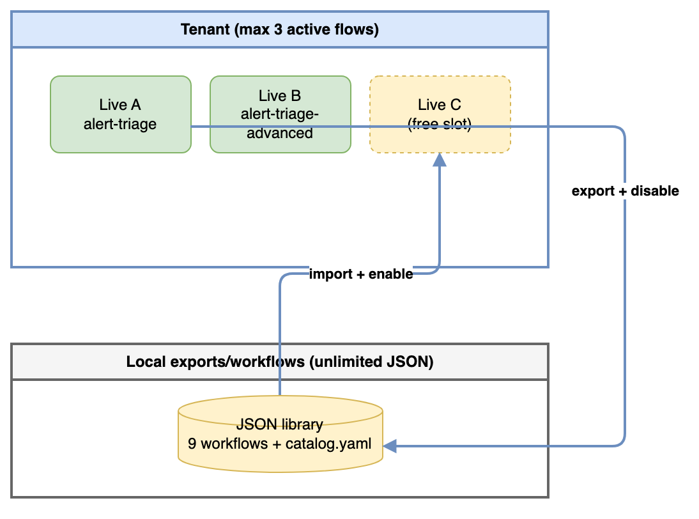
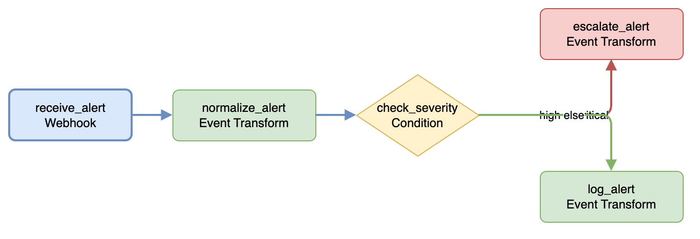
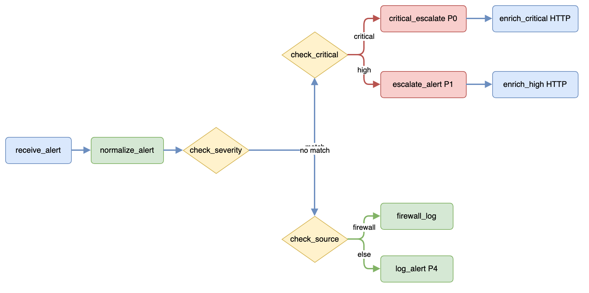
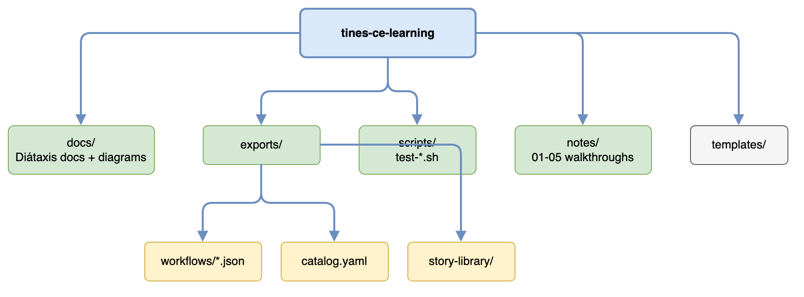

# Tines CE Learning — Documentation

Documentation for this repository follows the [Diátaxis framework](https://diataxis.fr/): four document types, each with a distinct purpose.

| Type | When to read | Documents |
|---|---|---|
| **Tutorial** | You are new and want a guided path | [Getting started](tutorials/getting-started.md) |
| **How-to** | You need to solve a specific task | [Swap workflows](how-to/swap-workflows-on-ce.md) · [Export/import](how-to/export-import-stories.md) · [Test webhooks](how-to/test-webhooks-locally.md) |
| **Reference** | You need facts, tables, or file paths | [Workflow catalog](reference/workflow-catalog.md) · [CE limits](reference/ce-limits.md) · [Scripts](reference/scripts-and-payloads.md) · [Diagrams](reference/diagrams.md) |
| **Explanation** | You want to understand why things work this way | [CE operating model](explanation/ce-operating-model.md) · [Alert triage pipelines](explanation/alert-triage-pipelines.md) · [Complex patterns](explanation/complex-workflow-patterns.md) |

## Diagrams

Architecture diagrams live in [`diagrams/`](diagrams/). The library now includes **29 workflow JSON exports** (20 complex generated + 9 prior exports).

| Topic | Source | Preview |
|---|---|---|
| CE flow strategy | [ce-flow-strategy.drawio](diagrams/ce-flow-strategy.drawio) |  |
| Workflow library (29) | [workflow-library-overview.drawio](diagrams/workflow-library-overview.drawio) |  |
| Alert triage (base) | [alert-triage-base.drawio](diagrams/alert-triage-base.drawio) |  |
| Alert triage (advanced) | [alert-triage-advanced.drawio](diagrams/alert-triage-advanced.drawio) |  |
| Repository layout | [repo-layout.drawio](diagrams/repo-layout.drawio) |  |

Regenerate PNGs after editing a diagram:

```bash
node ~/.cursor/skills/project-documenter--drawio/scripts/drawio-to-png.mjs --dir docs/diagrams
```

## Related material outside `docs/`

- **Step-by-step walkthroughs:** [`notes/`](../notes/) (01–05) — original learning journal used to build these workflows.
- **Machine-readable index:** [`exports/catalog.yaml`](../exports/catalog.yaml).
- **Workbench prompts for unbuilt workflows:** [`exports/workflows/BUILD.md`](../exports/workflows/BUILD.md).
- **Generate complex workflows:** `python3 scripts/generate-complex-workflows.py`
