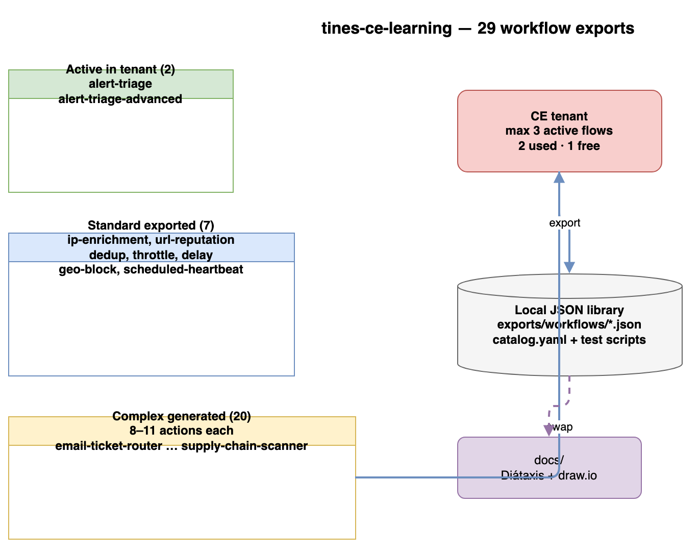

# Explanation: Complex workflow patterns

**Question:** What makes a workflow "complex" in this library, and how were the 20 generated exports structured?

---

## Complexity criteria

A workflow is marked **complex** in `exports/catalog.yaml` when it has:

- **8 or more actions** on a single connected flow
- **Multiple decision points** (nested Conditions)
- **HTTP enrichment** or special transforms (dedup, throttle, delay)
- **Four or more terminal outcomes** (escalate, log, audit, enrich paths)

Standard workflows (ip-enrichment, dedup-alerts, etc.) typically have 3–6 actions and a single branch.

---

## Two generation patterns

Regenerate all 20 with:

```bash
python3 scripts/generate-complex-workflows.py
python3 scripts/update-catalog-from-generated.py
```

### Pattern A — Advanced triage (11 actions)

Used for SOAR-style alert/case/incident routing. Same topology as [Alert Triage Advanced](alert-triage-pipelines.md):

```
webhook → normalize → check_severity
  ├─ match → check_critical → P0/P1 escalate → HTTP enrich
  └─ no match → check_source → audit log | standard log
```

Examples: `phishing-analyzer`, `vulnerability-scorer`, `supply-chain-scanner`.

### Pattern B — Enriched pipeline (10 actions)

Used for operational pipelines with rate control and external lookup:

```
webhook → normalize → dedup → throttle → HTTP lookup → check_severity
  → delay → check_http_ok → escalate | standard_log
```

Examples: `manual-playbook-runner`, `ransomware-response`, `cloud-misconfig-triage`.

---

## Generated vs tenant-native

| Aspect | Generated JSON | Built in tenant |
|---|---|---|
| Credentials | None (httpbin only) | Can wire real APIs |
| Webhook secret | Random per generate | From Tines UI |
| Story IDs | `null` in catalog | Real tenant IDs after import |
| Status in catalog | `generated-only` | `active` or `exported-only` |

Import any JSON via **Stories → Import**, copy the webhook URL to `.env`, run `scripts/test-<id>.sh`.

---

## Library scale



| Bucket | Count |
|---|---|
| Active in tenant | 2 |
| Standard exported | 7 |
| Complex generated | 20 |
| **Total workflow JSON** | **29** |

---

## Related

- [Reference: Workflow catalog](../reference/workflow-catalog.md)
- [How-to: Swap workflows on CE](../how-to/swap-workflows-on-ce.md)
